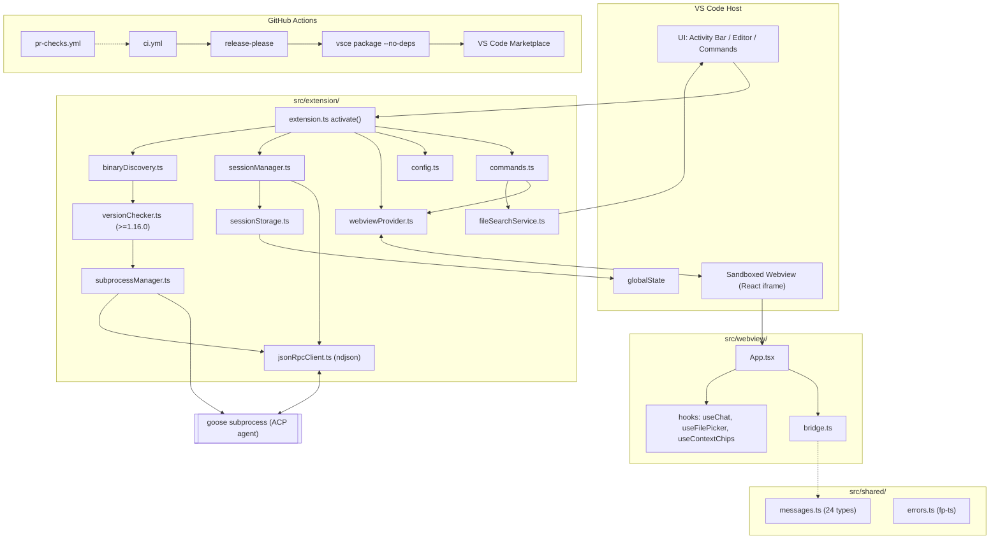
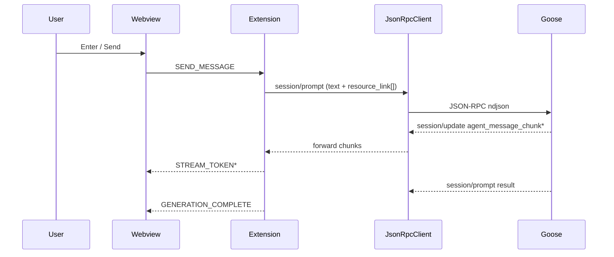

# System Architecture

**Project**: vscode-goose
**Architecture Pattern**: Layered, message-driven thin UI bridge
**Last Updated**: 2026-04-23

## High-Level Architecture

## Patterns

- **Bridge / Adapter (thin UI)** — Extension is a pure orchestration layer translating VS Code events to/from an external Goose subprocess via ACP. All AI behavior lives in goose. Evidence: `AGENTS.md`, `src/extension/extension.ts`.
- **Layered Architecture** — Four layers: Webview (React/iframe), Extension host (VS Code integration), ACP client (JSON-RPC), Goose subprocess. Dependencies flow downward only. Evidence: `src/{extension,webview,shared}/`.
- **Message-Driven Communication** — Strongly-typed `postMessage` contract with ~24 `WebviewMessage` variants, factories, and guards. Evidence: `src/shared/messages.ts`, `src/webview/bridge.ts`.
- **Gated Activation** — Multi-stage: binary discovery → version validation (>= 1.16.0) → subprocess spawn → ACP `initialize`. Each stage can block UI with actionable status. Evidence: `binaryDiscovery.ts`, `versionChecker.ts`, `subprocessManager.ts`.
- **Typed Async Error Handling (fp-ts)** — `Either`/`TaskEither` for recoverable async failures instead of thrown exceptions. Evidence: `src/shared/errors.ts`, `package.json` (fp-ts `^2.16.0`).
- **Sandboxed Webview with Ready-Sync Queue** — Ready handshake + queued outbox so extension-originated events are not dropped before the React app mounts. Evidence: `src/extension/webviewProvider.ts`.
- **Conventional Commits + release-please automation** — Every push to main runs release-please; merging the Release PR auto-tags `vscode-v*`, builds VSIX with `vsce --no-dependencies`, publishes to Marketplace. Evidence: `commitlint.config.js`, `.husky/*`, `release-please-config.json`, `.github/workflows/ci.yml`.

## Component Architecture

### Webview (Presentation)
**Purpose**: Sandboxed React UI for chat, context chips, @ file picker.
**Location**: `src/webview/`
**Components**: `App.tsx`, `bridge.ts`, `components/*`, `hooks/*`.
**Dependencies (internal)**: Shared (messages/types).

### Shared Contracts
**Purpose**: Cross-boundary type contracts compiled into both bundles.
**Location**: `src/shared/`
**Components**: `messages.ts`, `types.ts`, `errors.ts`, `contextTypes.ts`, `sessionTypes.ts`, `fileReferenceParser.ts`.

### Extension Host (Orchestration)
**Purpose**: VS Code integration, activation gate, webview lifecycle, session state.
**Location**: `src/extension/`
**Components**: `extension.ts`, `commands.ts`, `config.ts`, `logger.ts`, `sessionManager.ts`, `sessionStorage.ts`, `webviewProvider.ts`, `fileSearchService.ts`.
**Dependencies**: Shared, ACP Client.

### ACP Client (Protocol)
**Purpose**: JSON-RPC 2.0 over ndjson; subprocess + binary discovery + version gate.
**Location**: `src/extension/`
**Components**: `jsonRpcClient.ts`, `subprocessManager.ts`, `binaryDiscovery.ts`, `versionChecker.ts`.
**Dependencies**: goose subprocess.

### Goose Subprocess (External)
**Purpose**: AI agent daemon speaking ACP over stdin/stdout; owns all model/tool behavior.
**Components**: goose binary (>= 1.16.0), out-of-tree.

## Data Flow

### Version-Gated Activation
1. VS Code fires `onStartupFinished`.
2. `extension.ts activate()` constructs logger, config, webviewProvider.
3. `binaryDiscovery.ts` resolves the goose binary (config override or PATH lookup).
4. `versionChecker.ts` spawns `goose --version` and validates `>= 1.16.0`.
5. `subprocessManager.ts` spawns the long-lived goose ACP process.
6. `jsonRpcClient.ts` sends `initialize` and registers a notification handler.
7. `sessionManager.ts` calls `session/new` or `session/load` and hydrates the webview.

### Chat Prompt Streaming

### Send Selection to Goose (Cmd/Ctrl+Shift+G)
1. Keybinding or `editor/context` menu triggers `goose.sendSelectionToChat`.
2. `commands.ts` captures selection + file URI + line range.
3. Reveals `goose.chatView`, waits for the webview ready signal.
4. Posts `ADD_CONTEXT_CHIP` with file/range metadata.
5. Webview renders the chip; next user prompt serializes it as a `resource_link` block.

### File Search (@ mention)
1. Webview detects `@` at a word boundary in the input.
2. Webview sends `FILE_SEARCH` with the query.
3. `fileSearchService.ts` calls `workspace.findFiles` with recent-score sort.
4. Extension returns `SEARCH_RESULTS`.
5. Webview renders the picker and emits a chip on selection.

### Release & Publish
1. Commits land on `main` with Conventional Commit prefixes.
2. `.github/workflows/ci.yml` runs release-please on push.
3. release-please opens/updates a Release PR bumping `package.json` and the manifest.
4. Merging the Release PR tags `vscode-v<version>` and triggers the release job.
5. Job runs `bun install --frozen-lockfile`, `bun run build`.
6. Job runs `vsce package --no-yarn --no-dependencies -o dist/vscode-goose-<v>.vsix`.
7. `gh release upload` attaches VSIX; `vsce publish --packagePath` ships to the Marketplace when `VSCE_PAT` is set.

## Integration Points

### External Services
- **Goose ACP Subprocess** — external AI agent; JSON-RPC 2.0 over stdin/stdout (ndjson). Methods: `initialize`, `session/{new,load,prompt,cancel}`. Notification: `session/update`. Min version 1.16.0. Context chips → `resource_link` blocks. Spec: agentclientprotocol.com.
- **VS Code Extension API** — in-process host (engines `^1.95.0`). Contributes: viewsContainer `goose`, view `goose.chatView`, commands (`showLogs`, `restart`, `sendSelectionToChat`), `editor/context` menu, keybinding Cmd/Ctrl+Shift+G. Settings: `goose.binaryPath`, `goose.logLevel`. `workspace.findFiles` for @ picker.
- **GitHub Actions CI** — two workflows. `ci.yml`: release-please + lint/test/build on push to `main`. `pr-checks.yml`: lint/test/build on PR. Both use `oven-sh/setup-bun@v2` with frozen lockfile. Release job adds `actions/setup-node@v4` for `vsce`.
- **release-please** — `googleapis/release-please-action@v4`. Config: `release-please-config.json` with `tag-separator vscode-v`, `include-component-in-tag=false`, `extra-files=['package.json']`, `bootstrap-sha` pinned. Manifest: `.release-please-manifest.json` tracks `.` at `0.2.1`. Uses `RELEASE_PLEASE_PAT`.
- **VS Code Marketplace** — public distribution. Publisher `block`. Packaging `vsce package --no-dependencies` (deps bundled by Bun). Publish gated on `VSCE_PAT`.
- **Husky + commitlint** — `.husky/pre-commit` + `.husky/commit-msg` installed by `prepare: 'husky'`. `commitlint.config.js` uses `@commitlint/config-conventional` — required for release-please bump detection.
- **Biome** — lint + format (single-tool replacement). Invoked via `bunx biome`. `biome.json` ignores `node_modules`, `dist`, `out`, `.vscode-test`, `*.vsix`, `package-lock.json`, `bun.lockb`, and `package.json`.

### Internal Communication
- **Extension ↔ Webview**: typed `postMessage` discriminated-union over shared contract in `src/shared/messages.ts`.
- **Extension ↔ Goose**: JSON-RPC 2.0 with ndjson framing over spawned subprocess stdio.

## Data Flow Summary

**State Management**
- Extension: in-memory `SessionManager` mirrored to VS Code `globalState` via `src/extension/sessionStorage.ts`.
- Webview: transient UI state in React hooks (`useChat`, `useContextChips`, `useFilePicker`).
- Conversation history: owned by goose; surfaced via `session/load` replay.

**Primary data flows**
- **User chat turn**: keystrokes → bridge `postMessage` → extension builds ACP blocks → `session/prompt` → `session/update` stream → `STREAM_TOKEN` → rendered markdown.
- **Session restore**: stored session id → `sessionManager.loadSession` → `session/load` → history replay.
- **Release artifact**: Conventional Commits → release-please Release PR → merge tags `vscode-v<v>` → bun build → VSIX → GitHub Release + Marketplace.

## Security Architecture

- **Webview CSP**: `getWebviewContent` sets `default-src 'none'; script-src 'nonce-…'`; `localResourceRoots` restricted to `dist/webview`.
- **No remote assets**: all scripts/styles served from the extension bundle.
- **External links**: anchors in `MarkdownRenderer` post `OPEN_EXTERNAL_LINK`; VS Code `env.openExternal` enforces user confirmation where configured.
- **Minimum version gate**: fail-closed activation blocks any ACP interaction if the goose binary is missing or below 1.16.0.

## Deployment Architecture

- **Type**: VS Code Extension (VSIX).
- **Environment**: VS Code engines `^1.95.0` on the user's machine; spawns the local goose binary as a child process.
- **Distribution**: VS Code Marketplace (publisher `block`) + GitHub Releases with tag prefix `vscode-v`, driven by release-please.
- **Build toolchain**: Bun bundler for both extension (CJS, node target, `vscode` external) and webview (minified IIFE); Tailwind CSS v4 via `@tailwindcss/cli`; TypeScript for type-checking only.
- **Packaging**: `vsce package --no-dependencies` — relies on bundled `dist/*`. `.vscodeignore` whitelists `dist/extension.js(.map)`, `dist/webview/**`, `resources/**`, `package.json`, `README.md`, `LICENSE`; excludes `src/`, `node_modules/`, `docs/`, `.rp1/`, `biome.json`, lockfiles, `*.test.ts`.
- **CI**: `ci.yml` (main + release) and `pr-checks.yml` (PR) using `oven-sh/setup-bun@v2` with frozen-lockfile installs.
