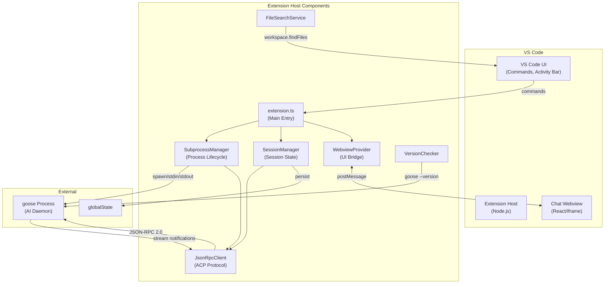
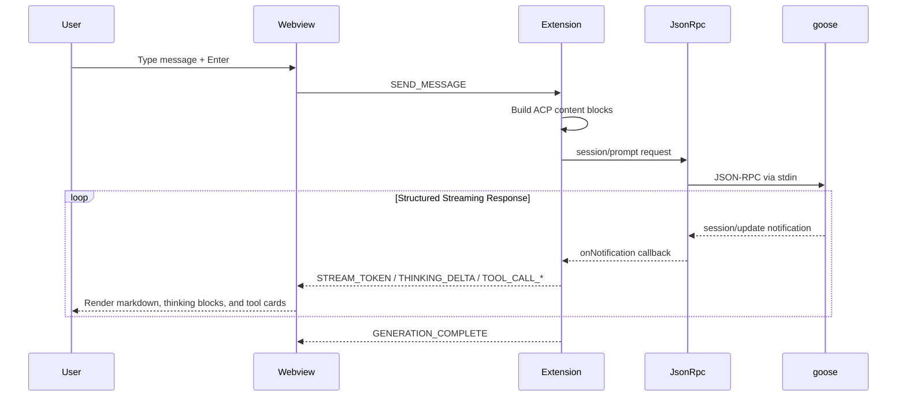

# System Architecture

**Project**: VS Code Goose
**Architecture Pattern**: Bridge/Adapter with Message-Driven Communication
**Last Updated**: 2026-03-28

## High-Level Architecture

## Architectural Patterns

### Bridge/Adapter Architecture

The extension is deliberately minimal - a thin UI layer connecting VS Code webview to Goose backend via Agent Communication Protocol (ACP). No business logic in the extension itself.

### Layered Architecture

Four distinct layers with unidirectional dependencies:

1. **Webview** (presentation) - React components
2. **Extension** (orchestration) - VS Code integration
3. **ACP Client** (protocol) - JSON-RPC handling
4. **Goose subprocess** - External process communication

### Message-Driven Communication

All communication between webview and extension uses a strongly-typed message passing system with factory functions and type guards. Recent additions expanded the protocol to cover structured assistant streaming, tool call lifecycle events, and session settings updates.

### Gated Activation

Multi-stage activation gate: binary discovery → version validation → subprocess spawn. Each stage can block activation with appropriate user messaging.

## Component Architecture

### Extension Host Layer

**Location**: `src/extension/`
**Components**:

- `extension.ts` - Orchestrates activation, ACP session init, wires components
- `sessionManager.ts` - Session lifecycle, history replay, ACP coordination
- `webviewProvider.ts` - Webview lifecycle, message queue, ready sync
- `subprocessManager.ts` - Spawns goose binary, manages lifecycle events
- `jsonRpcClient.ts` - JSON-RPC 2.0 client with ndjson framing
- `versionChecker.ts` - Binary version validation (>= 1.16.0)
- `fileSearchService.ts` - Workspace file discovery for @ picker
- `commands.ts` - VS Code command registration (showLogs, restart, sendSelectionToChat)

### Webview Layer

**Location**: `src/webview/`
**Components**:

- `App.tsx` - Root component with status, session/chat state, and right-side history pane layout
- `bridge.ts` - postMessage abstraction for extension communication
- `ChatView.tsx` - Chat container with keyboard navigation
- `InputArea.tsx` - Input with chips, file picker integration, and mode/model controls
- `useChat.ts` - Reducer-based chat state management for text/thinking/tool-call streams
- `useSession.ts` - Session list, loading state, pane visibility, and session setting updates
- `useContextChips.ts` - Chip state management
- `useFilePicker.ts` - @ mention detection and search
- `ThinkingBlock.tsx` - Collapsible rendering for assistant thinking traces
- `ToolCallCard.tsx` - Tool call lifecycle card with previews and raw details

### Shared Layer

**Location**: `src/shared/`
**Components**:

- `messages.ts` - 24 WebviewMessage types, payloads, factories, guards
- `types.ts` - ProcessStatus, ChatMessage, MessageContext
- `errors.ts` - GooseError discriminated union, factory functions
- `contextTypes.ts` - ContextChip, FileSearchResult
- `fileReferenceParser.ts` - Parse file references from markdown

## Key Data Flows

### User Chat Message Flow

### Send Selection to Goose (Cmd+Shift+G)

1. User selects code and presses Cmd+Shift+G
2. `registerContextCommands` handler triggered
3. `goose.chatView.focus` reveals panel
4. `waitForReady()` ensures webview initialized
5. `createAddContextChipMessage()` sent with file/range
6. Webview displays chip and awaits user prompt

### File Search (@ Picker)

1. User types @ in chat input
2. `detectAtTrigger()` scans backwards for @ at word boundary
3. Webview sends FILE_SEARCH message with query
4. `fileSearchService.search()` uses `vscode.workspace.findFiles()`
5. Results sorted by recentScore
6. SEARCH_RESULTS message sent back
7. FilePicker dropdown displayed

### Version-Gated Activation

1. `discoverBinary()` locates goose binary
2. `checkVersion()` spawns `goose --version`
3. `meetsMinimumVersion()` validates >= 1.16.0
4. If version fails: `updateVersionStatus()` blocks UI
5. If version passes: spawn subprocess

### Session Settings Flow

1. `session/new` or `session/load` returns available mode/model metadata
2. `sessionManager.ts` normalizes ACP metadata into `SessionSettingsState`
3. Extension sends SESSION_SETTINGS to the webview
4. `SessionSettingsBar` renders mode/model selectors in the composer
5. User changes are sent back as `SET_SESSION_MODE` / `SET_SESSION_MODEL`
6. Extension maps those to ACP `session/set_mode`, `session/set_model`, or `session/set_config_option`

### Prompt Execution Without Local Timeout

`session/prompt` requests are issued with `timeoutMs: null`, so the client waits for Goose to finish instead of treating long-running responses as cancellations.

## Integration Points

### Goose ACP Subprocess

- **Protocol**: JSON-RPC 2.0 over stdin/stdout (ndjson framing)
- **Methods**: `initialize`, `session/new`, `session/load`, `session/prompt`, `session/set_mode`, `session/set_model`, `session/set_config_option`
- **Notifications Received**: `session/update`
- **Notifications Sent**: `session/cancel`
- **Version Requirement**: >= 1.16.0

### VS Code APIs

- **Workspace**: `findFiles()` for @ picker
- **Commands**: `goose.showLogs`, `goose.restart`, `goose.sendSelectionToChat`
- **Keybindings**: Cmd+Shift+G for sendSelectionToChat
- **Context Menus**: editor/context menu integration

## Deployment

- **Distribution**: VS Code Marketplace via VSIX
- **Build**: Bun bundler and Tailwind CSS v4
- **Linting**: Biome for formatting and linting
- **Webview Options**: `retainContextWhenHidden: true`
- **Version Gate**: Checks goose >= 1.16.0 before subprocess spawn
