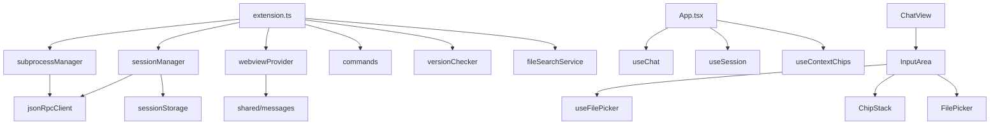

# Module & Component Breakdown

**Project**: VS Code Goose
**Analysis Date**: 2025-12-21
**Modules Analyzed**: 7 module groups

## Core Modules

### Extension Module (`src/extension/`)
**Purpose**: VS Code extension host - manages lifecycle, subprocess, ACP session, version checking, file search
**Files**: 12 | **Lines**: ~2,100

**Key Components**:
| Component | File | Purpose |
|-----------|------|---------|
| Extension Entry | `extension.ts` | Orchestrates activation, ACP session init, wires components |
| SubprocessManager | `subprocessManager.ts` | Spawns goose binary, manages lifecycle events |
| JsonRpcClient | `jsonRpcClient.ts` | JSON-RPC 2.0 client with ndjson framing |
| SessionManager | `sessionManager.ts` | Session lifecycle, history replay, ACP coordination |
| WebviewProvider | `webviewProvider.ts` | Webview lifecycle, message queue, ready sync |
| Commands | `commands.ts` | Command registration (showLogs, restart, sendSelectionToChat) |
| VersionChecker | `versionChecker.ts` | Binary version validation (>= 1.16.0) |
| FileSearchService | `fileSearchService.ts` | Workspace file search for @ picker |
| BinaryDiscovery | `binaryDiscovery.ts` | Cross-platform goose binary discovery |
| SessionStorage | `sessionStorage.ts` | Persists session metadata to globalState |
| Config | `config.ts` | VS Code configuration reader |
| Logger | `logger.ts` | Source-tagged logger using OutputChannel |

### Shared Module (`src/shared/`)
**Purpose**: Shared types and utilities between extension and webview
**Files**: 7 | **Lines**: ~1,100

**Key Components**:
| Component | File | Purpose |
|-----------|------|---------|
| Messages | `messages.ts` | 24 WebviewMessage types, factories, guards (~700 lines) |
| Types | `types.ts` | ProcessStatus, ChatMessage, MessageRole, MessageContext |
| ContextTypes | `contextTypes.ts` | ContextChip, FileSearchResult, LineRange |
| SessionTypes | `sessionTypes.ts` | SessionEntry, AgentCapabilities, groupSessionsByDate |
| Errors | `errors.ts` | GooseError discriminated union, factory functions |
| FileReferenceParser | `fileReferenceParser.ts` | Parse file references from markdown |
| Index | `index.ts` | Re-exports for convenient imports |

### Webview Module (`src/webview/`)
**Purpose**: React-based chat UI in sandboxed iframe
**Files**: 28 | **Lines**: ~2,500

**Sub-modules**:
- `hooks/` - State management hooks (6 files)
- `components/chat/` - Chat UI components (15 files)
- `components/picker/` - File picker dropdown (2 files)
- `components/icons/` - File type icons (2 files)
- `components/session/` - Session management UI (3 files)
- `components/markdown/` - Markdown rendering (3 files)

## Key Components

### SubprocessManager
**File**: `src/extension/subprocessManager.ts`
**Purpose**: Manage goose subprocess from spawn to termination
**Responsibilities**:
- Spawn goose binary with ACP protocol
- Handle process lifecycle events (exit, error)
- Provide JsonRpcClient access
- Graceful shutdown with SIGTERM then SIGKILL

### JsonRpcClient
**File**: `src/extension/jsonRpcClient.ts`
**Purpose**: JSON-RPC 2.0 over stdin/stdout with ndjson framing
**Responsibilities**:
- Send requests with timeout handling
- Route responses and notifications
- Manage pending request lifecycle

### SessionManager
**File**: `src/extension/sessionManager.ts`
**Purpose**: Coordinate session state between ACP and storage
**Responsibilities**:
- Create new ACP sessions
- Load sessions with history replay
- Track active session and capabilities
- TaskEither-based API for error handling

### WebviewProvider
**File**: `src/extension/webviewProvider.ts`
**Purpose**: VS Code WebviewViewProvider for chat panel
**Responsibilities**:
- Generate secure HTML with CSP
- Queue messages until webview ready
- Handle ready sync and reconnection
- Status and version status updates

### useChat Hook
**File**: `src/webview/hooks/useChat.ts`
**Purpose**: Chat message state management
**Responsibilities**:
- Reducer-based state with typed actions
- Handle streaming tokens
- Send messages with context chips
- Persist input draft

### useContextChips Hook
**File**: `src/webview/hooks/useContextChips.ts`
**Purpose**: Context chip state management
**Responsibilities**:
- Handle ADD_CONTEXT_CHIP messages
- Detect duplicates
- Keyboard navigation support
- Aria-live announcements

### useFilePicker Hook
**File**: `src/webview/hooks/useFilePicker.ts`
**Purpose**: @ mention file search
**Responsibilities**:
- Detect @ trigger at word boundary
- Debounced search (100ms)
- Keyboard navigation
- Remove @query after selection

## Module Dependencies

## External Dependencies

| Package | Version | Purpose |
|---------|---------|---------|
| vscode | ^1.95.0 | VS Code extension API |
| fp-ts | ^2.16.0 | Functional programming |
| react | ^19.1.0 | UI component library |
| react-markdown | ^10.1.0 | Markdown rendering |
| react-syntax-highlighter | ^15.6.1 | Code syntax highlighting |
| @tailwindcss/cli | ^4.1.0 | CSS framework |

## Module Metrics

| Module | Files | Lines | Components |
|--------|-------|-------|------------|
| extension | 12 | ~2,100 | 12 |
| shared | 7 | ~1,100 | 6 |
| webview | 28 | ~2,500 | 24 |
| webview/hooks | 6 | ~850 | 6 |
| webview/components/chat | 15 | ~950 | 14 |
| webview/components/picker | 2 | ~160 | 2 |

## Cross-Module Patterns

### Context Chip Flow
Editor selection → extension/commands → shared/messages → webview/useContextChips → components/ChipStack → sent with message as resource_link

### File Picker Request-Response
Webview @ trigger → shared/messages → extension/fileSearchService → shared/messages → webview/FilePicker dropdown

### Version Gating
extension/versionChecker → shared/messages → webview/VersionBlockedView

### Bridge Communication
Extension and webview communicate via typed postMessage with factories and guards. Messages are queued until webview ready.
